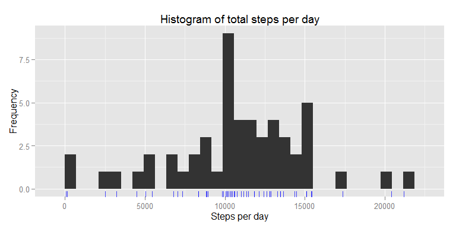
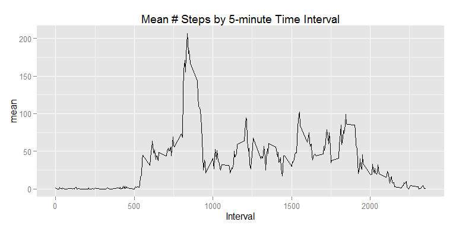
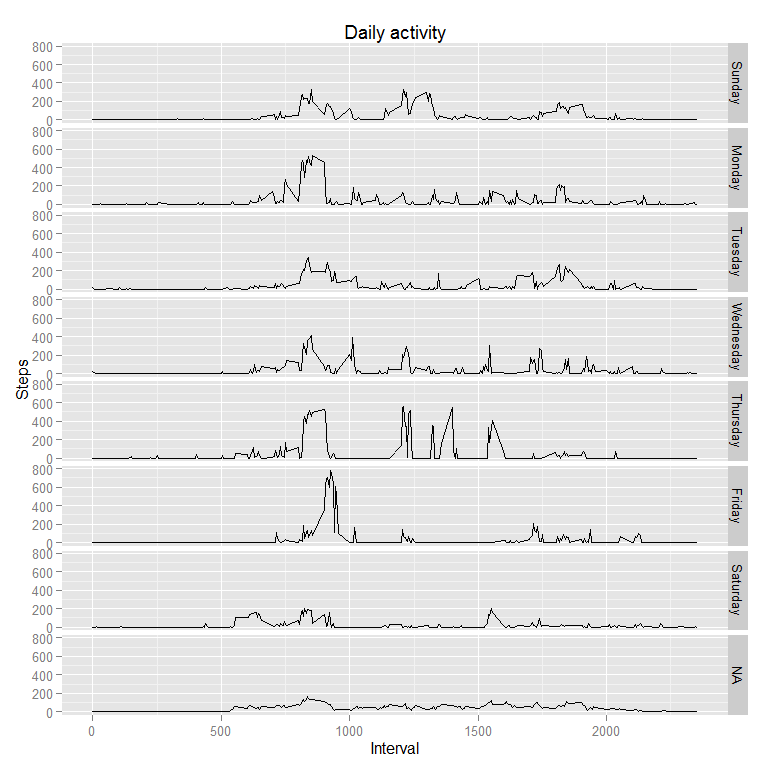
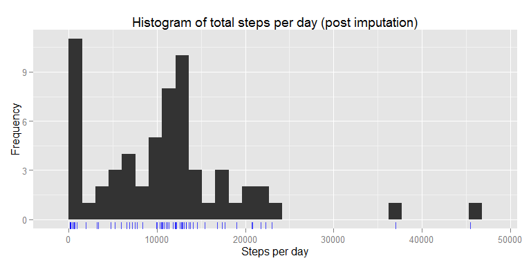
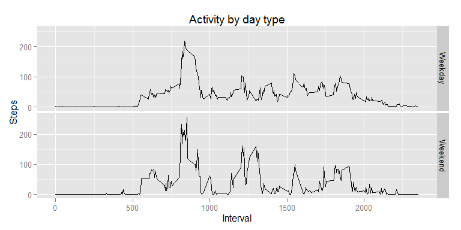

# PA1_template
qiaof  
July 16, 2015  


# Reproducible Research: Peer Assessment 1


## Loading and preprocessing the data

```r
unzip("activity.zip") 
```

```
## Warning in unzip("activity.zip"): error 1 in extracting from zip file
```

```r
data <- read.csv("activity.csv")
head(data)
```

```
##   steps      date interval
## 1    NA 10/1/2012        0
## 2    NA 10/1/2012        5
## 3    NA 10/1/2012       10
## 4    NA 10/1/2012       15
## 5    NA 10/1/2012       20
## 6    NA 10/1/2012       25
```

## What is mean total number of steps taken per day?

create histogram.

```r
steps.each.day <- tapply(data$steps, data$date, sum)

library(ggplot2)
bwidth <- diff(range(steps.each.day, na.rm=TRUE)) / 30
qplot(steps.each.day, geom="histogram", binwidth=bwidth) +
    geom_rug(color="blue", alpha=0.7) +
    labs(x="Steps per day", y="Frequency", title="Histogram of total steps per day")
```

 

```r
mu <- mean(steps.each.day, na.rm=TRUE)
med <- median(steps.each.day, na.rm=TRUE)
mu
```

```
## [1] 10766.19
```

```r
med
```

```
## [1] 10765
```

The mean number of total steps per day is **1.0766189\times 10^{4}** and the median
is **10765**.


## What is the average daily activity pattern?

The daily activity pattern averaged within each five minute interval across all days:

```r
library(plyr)
interval.means <- ddply(data, "interval", summarise,
                        mean=mean(steps, na.rm=TRUE))
ggplot(interval.means, aes(interval, mean)) + geom_path() +
    labs(title="Mean # Steps by 5-minute Time Interval", x="Interval")
```

 

```r
idx <- which.max(interval.means$mean)
interval.means[idx,]
```

```
##     interval     mean
## 104      835 206.1698
```

The interval with the maximum number of steps when averaged across all days is
**interval 835**.

## Imputing missing values

```r
incomplete.rows <- sum(!complete.cases(data))
incomplete.rows
```

```
## [1] 2304
```
There are **2304** rows with NAs in our dataset.
Count number of NA values exist within each five minute interval across all days using ddply:


```r
interval.nas <- ddply(data, "interval", summarise, na.count=sum(is.na(steps)))
head(interval.nas)
```

```
##   interval na.count
## 1        0        8
## 2        5        8
## 3       10        8
## 4       15        8
## 5       20        8
## 6       25        8
```

count the total number of NA observations by day:


```r
intervals.per.day <- 24 * 60 / 5 # how many 5 minute intervals in a day (288)
intervals.per.day
```

```
## [1] 288
```

```r
date.nas <- ddply(data, "date", summarise, na.count=sum(is.na(steps)))
head(date.nas)
```

```
##         date na.count
## 1  10/1/2012      288
## 2 10/10/2012        0
## 3 10/11/2012        0
## 4 10/12/2012        0
## 5 10/13/2012        0
## 6 10/14/2012        0
```

```r
sum(date.nas$na.count == intervals.per.day)
```

```
## [1] 8
```

There are eight days with no data, and furthermore these eight
days contain the entire set of NAs:


```r
dates.with.nas <- unique(date.nas$date[date.nas$na.count != 0])
length(dates.with.nas)
```

```
## [1] 8
```

Add a **weekday** column to our original data frame:


```r
data$weekday <- factor(weekdays(as.Date(data$date)),
                       levels=c("Sunday", "Monday", "Tuesday", "Wednesday",
                                "Thursday", "Friday", "Saturday"))
head(data)
```

```
##   steps      date interval   weekday
## 1    NA 10/1/2012        0 Wednesday
## 2    NA 10/1/2012        5 Wednesday
## 3    NA 10/1/2012       10 Wednesday
## 4    NA 10/1/2012       15 Wednesday
## 5    NA 10/1/2012       20 Wednesday
## 6    NA 10/1/2012       25 Wednesday
```

```r
head(data[data$interval == 0,])
```

```
##      steps      date interval   weekday
## 1       NA 10/1/2012        0 Wednesday
## 289      0 10/2/2012        0  Saturday
## 577      0 10/3/2012        0  Saturday
## 865     47 10/4/2012        0   Tuesday
## 1153     0 10/5/2012        0  Thursday
## 1441     0 10/6/2012        0    Sunday
```

```r
weekdays.with.na <- unique(data[data$date %in% dates.with.nas,]$weekday)
weekdays.with.na
```

```
## [1] Wednesday Friday    Thursday  Tuesday   <NA>     
## Levels: Sunday Monday Tuesday Wednesday Thursday Friday Saturday
```
compute the mean within each five minute interval separately for each weekday:


```r
means.sd <- ddply(data, c("interval", "weekday"),
                  summarise, steps=mean(steps, na.rm=TRUE))
```
Check if computing the mean by weekday is more informative than substituting the overall mean across all days:


```r
ggplot(means.sd, aes(interval, steps)) + geom_line() +
    facet_grid(weekday ~ .) +
    labs(x="Interval", y="Steps", title="Daily activity")
```

 

There seems to be enough variability between days to support imputation by
weekday. Let's fill in the missing values.


```r
# Separate the complete and incomplete cases
complete.ind <- complete.cases(data)
complete <- data[complete.ind,]
incomplete <- data[!complete.ind,]
# Merge the incomplete cases with the per-interval means by weekday
merged <- merge(incomplete[, c("weekday", "interval", "date")], means.sd,
                by=c("interval", "weekday"))
# Bind the complete and newly imputed values together
imputed <- rbind(complete, merged)
sum(!complete.cases(imputed)) # should be 0 incomplete cases now
```

```
## [1] 10656
```

create histogram and recalculate the mean and median:

```r
imp.steps.each.day <- tapply(imputed$steps, data$date, sum)

bwidth <- diff(range(imp.steps.each.day, na.rm=TRUE)) / 30
qplot(imp.steps.each.day, geom="histogram", binwidth=bwidth) +
    geom_rug(color="blue", alpha=0.7) +
    labs(x="Steps per day", y="Frequency",
         title="Histogram of total steps per day (post imputation)")
```

 

```r
imp.mu <- mean(imp.steps.each.day, na.rm=TRUE)
imp.med <- median(imp.steps.each.day, na.rm=TRUE)
imp.mu
```

```
## [1] 10873.55
```

```r
imp.med
```

```
## [1] 11015
```

The mean is now **1.0873546\times 10^{4}** and the median is **1.1015\times 10^{4}**,
which are both different from the values obtained before imputation
(1.0766189\times 10^{4}, 10765, respectively).


## Are there differences in activity patterns between weekdays and weekends?

Add an boolean indicator variable *weekend* to our data.frame that
includes imputed values and make a plot to answer the question.


```r
wkend.days <- c("Saturday", "Sunday")
day.type <- factor(imputed$weekday %in% wkend.days)
imputed$day.type <- mapvalues(day.type, from=c("FALSE", "TRUE"), to=c("Weekday", "Weekend"))
imputed.means <- ddply(imputed, .(interval, day.type), summarise, mean=mean(steps, na.rm=TRUE))
head(imputed.means)
```

```
##   interval day.type      mean
## 1        0  Weekday 2.6648697
## 2        0  Weekend 0.0000000
## 3        5  Weekday 0.6792453
## 4        5  Weekend 0.0000000
## 5       10  Weekday 0.2641509
## 6       10  Weekend 0.0000000
```

```r
ggplot(imputed.means, aes(interval, mean)) + geom_line() + facet_grid(day.type ~ .) +
    labs(x="Interval", y="Steps", title="Activity by day type")
```

 

The activities is less during the weekends. 
